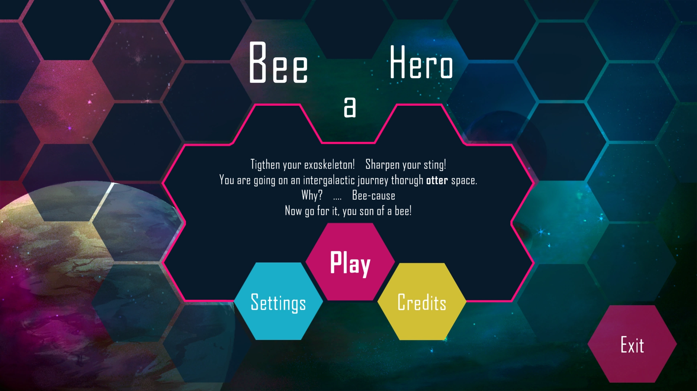
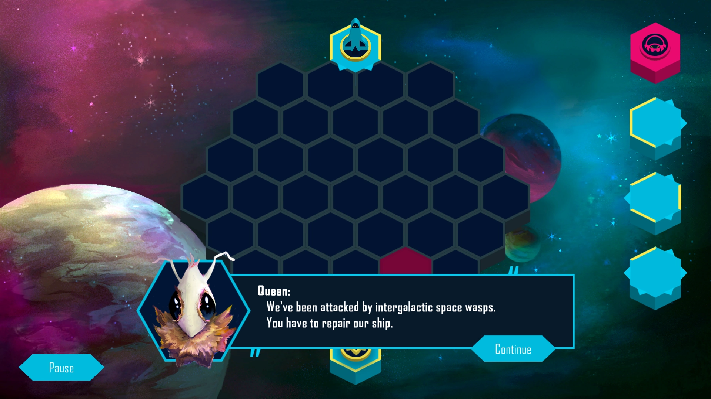
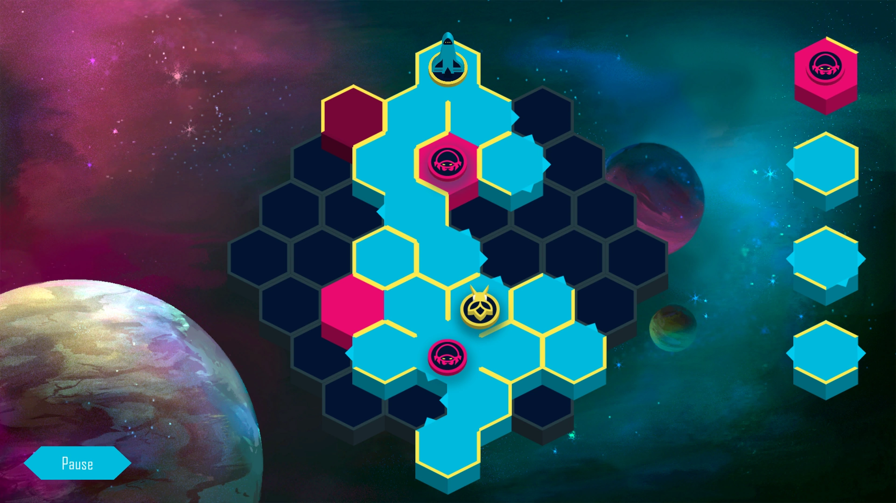
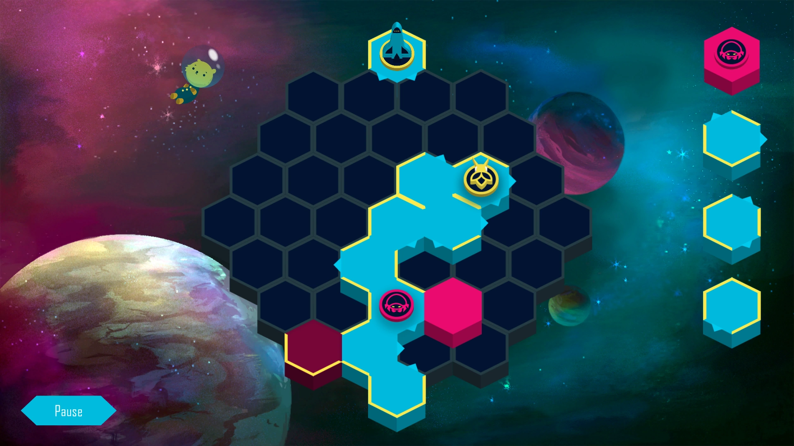

# Bee a Hero

Tighten your exoskeleton! Sharpen your sting!

You are going on an intergalactic journey through otter space.
Why? ... Bee-cause.
Now go for it, you son of a bee!

In this hex-tile based game, you have to fix your spaceship to get back to your queen.

Made during the [Global Game Jam 2020](https://globalgamejam.org/2020).

### [Play on itch.io](https://kruemelkatze.itch.io/bee-a-hero)

### [Download Executable](./Releases)

  
  

---
Made by (in no particular order):

  